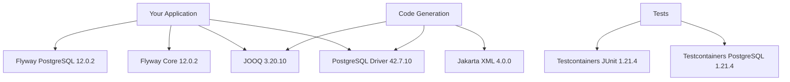

The plugin automatically adds all required dependencies to your project, so you don't need to manually declare them in your `build.gradle.kts` file.

## Dependency Overview

The plugin adds dependencies to three different configurations:

- **`implementation`** - Runtime dependencies available to your application code
- **`testImplementation`** - Dependencies available only in test scope
- **`jooqGenerator`** - Dependencies used during JOOQ code generation

## Implementation Dependencies

These dependencies are added to the `implementation` configuration and are available at both compile-time and runtime.

### JOOQ Core

```gradle
org.jooq:jooq:3.20.10
```

The core JOOQ library provides the DSL for building type-safe SQL queries. This is the main dependency you'll use in your application code to interact with the database.

**What it's for:**
- Type-safe SQL query construction
- Database access and query execution
- Generated table and record classes

### PostgreSQL JDBC Driver

```gradle
org.postgresql:postgresql:42.7.10
```

The official PostgreSQL JDBC driver enables Java/Kotlin applications to connect to PostgreSQL databases.

**What it's for:**
- Database connectivity
- JDBC protocol implementation
- Required by JOOQ at runtime

### Flyway Core

```gradle
org.flywaydb:flyway-core:12.0.2
```

Flyway's core library for database migrations. Handles versioned migration execution and schema history tracking.

**What it's for:**
- Running database migrations during code generation
- Managing schema evolution
- Migration versioning and validation

### Flyway PostgreSQL Database Support

```gradle
org.flywaydb:flyway-database-postgresql:12.0.2
```

PostgreSQL-specific Flyway support for advanced database features.

**What it's for:**
- PostgreSQL-specific SQL syntax support
- PostgreSQL data type handling
- Optimized migration execution for PostgreSQL

## Test Dependencies

These dependencies are added to the `testImplementation` configuration and are only available in test code.

### Testcontainers PostgreSQL

```gradle
org.testcontainers:postgresql:1.21.4
```

Provides a PostgreSQL container implementation for Testcontainers, allowing the plugin to spin up a real PostgreSQL database for code generation.

**What it's for:**
- Spinning up PostgreSQL containers for JOOQ generation
- Integration testing with real databases
- Isolated, reproducible test environments

### Testcontainers JUnit Jupiter

```gradle
org.testcontainers:junit-jupiter:1.21.4
```

Integrates Testcontainers with JUnit 5, providing lifecycle management and test extensions.

**What it's for:**
- JUnit 5 integration
- Container lifecycle management
- Test framework compatibility

## JOOQ Generator Dependencies

These dependencies are added to the `jooqGenerator` configuration and are used only during code generation.

### PostgreSQL JDBC Driver (Generator)

```gradle
org.postgresql:postgresql:42.7.10
```

The same PostgreSQL driver is also needed during code generation for JOOQ to introspect the database schema.

### Jakarta XML Binding API

```gradle
jakarta.xml.bind:jakarta.xml.bind-api:4.0.0
```

Required by JOOQ's code generator for XML-based configuration processing.

**What it's for:**
- JOOQ configuration parsing
- XML binding support
- Code generation tooling

## Version Management

All dependency versions are managed by the plugin and sourced from `libs.versions.toml`:

```toml
[versions]
jooq = "3.20.10"
flyway = "12.0.2"
testcontainers = "1.21.4"
postgresql = "42.7.10"
jakartaXmlBind = "4.0.0"
```

You **cannot** override these versions without potentially breaking the plugin's functionality.

## Additional Applied Plugins

The plugin also applies three Gradle plugins:

1. **`org.jetbrains.kotlin.jvm`** - Kotlin JVM support
2. **`org.flywaydb.flyway`** - Flyway Gradle plugin
3. **`nu.studer.jooq`** - JOOQ Gradle plugin (version 10.2)

These are automatically applied when you apply the Flyway-JOOQ Convention Plugin.

## Source Reference

Dependencies are added in the plugin source code at:
`FlywayJooqConventionPlugin.kt:32-43`

## Dependency Graph



## Related

<CardGroup cols={2}>
  <Card title="Extension API" icon="gear" href="/reference/extension-api">
    Configure the plugin behavior
  </Card>
  <Card title="Quick Start" icon="rocket" href="/quickstart">
    Get started with the plugin
  </Card>
</CardGroup>